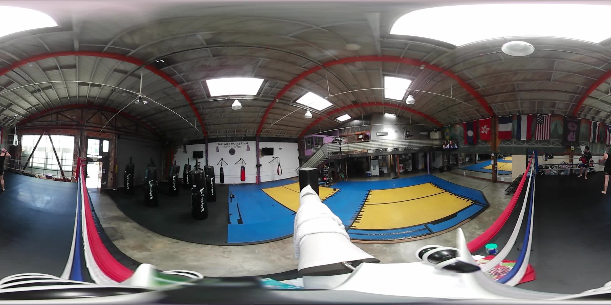
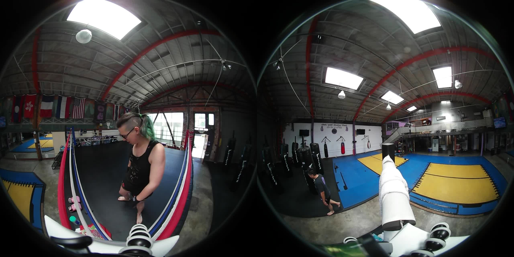
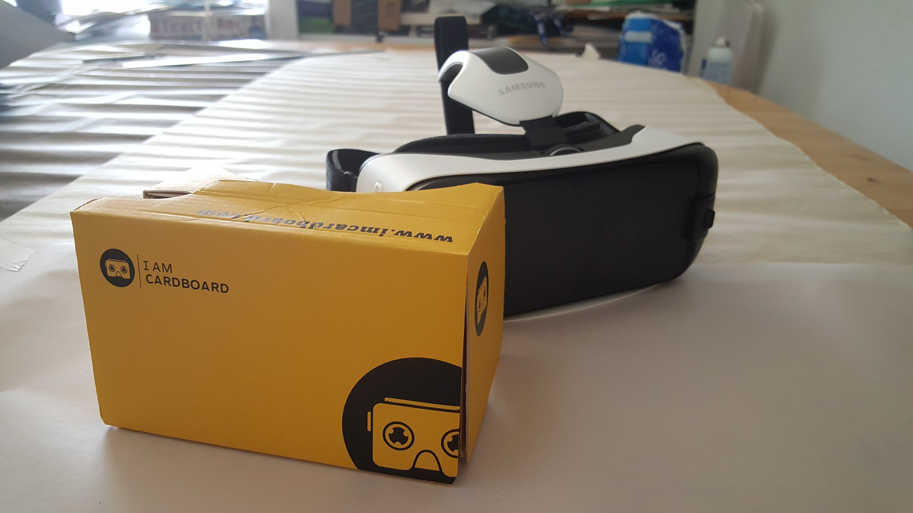

## Example

<p><video data-three-sixty-video data-three-sixty-video-lat="15" data-three-sixty-video-long="0" poster="./images/muaythai.jpg" src="https://ada-pull-zone-egnalefgk5.netdna-ssl.com/mt2.webm" width="450" height="300" controls crossorigin="anonymous" type="video/webm; dimension=360;"></video></p>
<script src="build/three.min.js"></script>
<script src="build/main.js"></script>

* On a desktop you should be able to pan the video with the mouse.
* On a mobile you should be able to enter cardboard mode and view VR through a google cardboard.
* If in the Samsung browser for VR then entering full screen should display it using the native VR.

## Thanks

Before I begin, I'd like to say thank you to my coach for letting me film at my gym, Dek Wat Muay Thai.

## Introduction

This project was researched in 20% time in the Financial Times lab, FTLabs.

The goal of the is project is to see whether it is possible to produce video using commercially available hardware and make it available cross platform without video, VR or web expertise.

Using the WebVR polyfill and THREE.js I assembled a simple 360 video viewer which to be embedded into a web page and will try to take advantage of native 360 video or WebVR support.

I have intention on adding this as an [origami](http://origami.ft.com/) module so that anyone can use this by just including a script/css with a small amount of markup.

## The markup

```html
<video data-three-sixty-video data-three-sixty-video-lat="15" data-three-sixty-video-long="0" poster="./images/muaythai.jpg" src="https://ada-pull-zone-egnalefgk5.netdna-ssl.com/mt2.webm" width="450" height="300" controls crossorigin="anonymous" type="video/webm; dimension=360;">
```

The outer span acts as a wrapper for the added DOM elements. The video's attributes:

* poster="[./images/muaythai.jpg](./images/muaythai.jpg)" - like with native video the poster (also a 360 image) will be displayed until the video is played.
* crossorigin="anonymous" - needed if the video is stored off site.
* type="video/webm; dimension=360;" - The `dimension=360;` part indicates to the Samsung VR web browser that this video should be displayed 360 when fullscreen.


*The poster image for the video, it is a snap shot of the full 360 video at 2560x1280 @ 30fps*

## The camera


*The Video Camera, a Samsung Gear 360, mounted on a gorilla pod.*

The camera is a Samsung Gear 360 video camera I received as a speakers gift from Samsung Developer Conference. It has two fish eye lenses pointing in opposite directions.

It requires a micro SD card and has a rechargeable battery.

I filmed for 30 minutes and used one bar of battery power. I used 10.5GB of space on the SD card. The camera automatically split the videos across 3 10 minute long 3.5GB  video files.

## The Video

I tested the video at my gym by mounting it on a corner of the ring and leaving it to film for 30 minutes. The raw footage from the camera consisted of the view from each camera position side by side.


*Raw Video Footage*

To convert the video from the RAW footage to the side by side footage to the sphere map for the video I had to load it across to the [Gear 360 app](https://play.google.com/store/apps/details?id=com.samsung.android.samsunggear360manager&hl=en).

> NB: The Gear 360 app is *only* compatible with Samsung Smart phones. i.e. Galaxy S6, Galaxy S7, each 10 minute video segment is 3.5GB each! So you will need to make lots of room on your device.

The app uses wifi and bluetooth to transfer the videos from the camera it does the sphere mapping distortion on the fly. As you may guess doing crazy huge video encoding on the phone whilst also downloading over wifi drains the battery power makes your phone hot and take a while. So plug you phone into a charger and go to lunch.

Then use a usb cable to copy the videos from the phone onto your computer. The new videos are still 3.5GB each so this could also take a while.

Now you have your videos you can edit them, any video editor should do, I used [Pitivi](http://www.pitivi.org/).

After cutting the videos together and selecting a segment I liked I exported them as WebM with the following settings:

```
Resolution: 2560x1280
Framerate: 30fps
Wrapper: WebM
```

This got me a 5 minute long video at 40MB. I found the export settings in the app itself not Ideal for export for Web, it encoded it as an MP4 but the files were not ideal for streaming often the whole video would need to download first.

The nice folks at MaxCDN helped me set up a great streaming solution which would work with CORS headers and https.

## Testing and Support

So far I have tested it on my mobile phone (Samsung Galaxy S6, Chrome and Samsung browser)

It does not work in iOS safari unless in a standalone web app.

It currently has some unresolved issues with the latest Chrome for Android.

With the Gear VR and Google Cardboard v2.

It relies heavily on the [WebVR polyfill](https://github.com/borismus/webvr-polyfill) so should work on iPhones. It should also work on WebVR enabled desktop browsers with supported headsets.


*Google Cardboard (front) and Samsung Gear VR (rear)*

## Conclusion

This is a prototype and still has some usability issues to hammer out but it shows that VR is the kind of thing which goes ideal in the web.

There seems to be a cors issue with the Service Worker as well, if this is an issue with you use ctrl+reload to bypass the service worker.

The source code is here:

https://github.com/adaroseedwards/three-sixty-video
